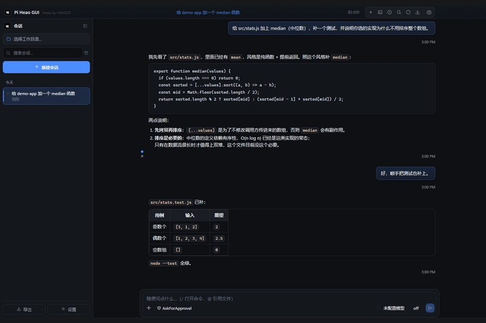

# Pi Heao GUI

> 中文版见 [README.zh-CN.md](README.zh-CN.md) —— 中文版为准（若两版有出入，以中文版为准）。
[](https://github.com/Q1y1ng/pi-heao-gui/actions/workflows/ci.yml)
[](LICENSE)
[](https://github.com/Q1y1ng/pi-heao-gui/releases/latest)


## 1.3.1 — the permission gate actually gates, and the leaks are closed

Released 2026-09-21 · [release notes](docs/release-notes-1.3.1.md) · [download](https://github.com/Q1y1ng/pi-heao-gui/releases/tag/v1.3.1)

A security/stability/process audit, fixed. Two things a user will notice:

- **"Dangerous commands need confirmation" now confirms.** The mode defaulted to `AskForApproval` while the
  pattern list defaulted to **empty** — and an empty list in the gate means "nothing matches", so every bash
  command ran, with no screen that could have changed it. The app now ships **39 default rules** (upstream
  pi-agent-studio's list, byte for byte, pinned by a test), editable and restorable from Settings → 权限, and
  `/permission` reports the mode and how many rules are live.
- **The gate covers more than one tool and more than one process.** A `write`/`edit` whose path resolves
  **outside the session's working directory** is asked about (that is how "it only touched the repo" rewrites
  `~/.pi/agent/settings.json`), and a `subagent` — a second `pi` — now mounts the same gate, so delegating a
  dangerous command can no longer skip every prompt.
- **The file panel is no longer "all of your home directory".** Its default root *is* the home directory, so
  the chat window (the one that renders model output and is documented as unable to touch agent config) could
  read `~/.pi/agent/auth.json` and overwrite `~/.pi/standalone/config.json`. `~/.pi`, `~/.ssh`, `~/.aws`,
  `~/.gnupg`, `~/.docker`, `~/.config`, `~/.npmrc`, `~/.git-credentials`, `~/.gitconfig` and `%APPDATA%` are
  refused now; a project's own `.pi/` is untouched.
- **No more pi processes you can neither see nor kill.** Two messages sent after pi died started two pi
  processes, the second overwriting the reference and the first **never exiting** (not even on quit), both
  writing the same session file; a subagent had exactly one way out (the caller's abort), so one wedged child
  ended the conversation forever. Reload is now serialised, subagents have a 15-minute watchdog
  (`PI_SUBAGENT_TIMEOUT_MS`), and timeout/abort kill the **whole** tree — as does a timed-out `pi install`,
  which used to leave npm installing into the agent prefix.
- **Opening a repository no longer executes its `.pi/mcp.json`.** That file is a list of commands, started with
  your privileges whenever a session opens there; pi's own project-trust gate covers settings/extensions/
  skills/prompts/themes but **not** `mcp.json`. It asks once now (naming the servers and the directory),
  remembers per directory and file hash, and re-asks when the file changes. MCP calls also gained a timeout.
- **Also fixed**: commit-message generation failing on any large diff (the prompt rides in argv, and Windows
  caps a command line at 32 767 characters — the old diff budget alone was 64 KB); the diff window and session
  import reading files of any size (the "cap" was checked *after* writing); an orphan terminal left behind when
  a window closed while the terminal waited for the start-up queue; portable builds being offered the installer
  as an update; secrets reaching the diagnostics bundle; and `studio/pi-chat/package-lock.json` being ignored,
  which let two builds of the same tag differ.
- **CI now loads the terminal stack**: a blocking `npm run check:pty` spawns a ConPTY under Electron and
  requires an echo back. Nothing in CI used to `require("node-pty")` — a broken native module shipped as "the
  dock is blank", with every check green.

## 1.3.0 — every window at a glance, and the directories you come back to

Released 2026-09-19 · [release notes](docs/release-notes-1.3.0.md) · [download](https://github.com/Q1y1ng/pi-heao-gui/releases/tag/v1.3.0)

> ⚠️ Erratum (that release's **source archive** only): the `pi-heao-gui-1.3.0-source.zip` asset is really a
> tar file renamed to `.zip` — Git Bash's GNU tar ignores `-a` (see [docs/RELEASING.md](docs/RELEASING.md)) —
> so Windows' built-in extractor refuses it. For 1.3.0 sources, clone the repository and check out `v1.3.0`, or
> use the 1.3.1 archive instead. **Neither installer is affected**, and 1.3.1 onward is packed with Windows'
> own bsdtar; the release checklist now verifies the archive's magic bytes.

- **A window board.** With several windows open, "which one is running, which one is waiting on me,
  which one is idle" could only be pieced together from the tray menu and the title bar. There is now
  a grid icon in the title bar: a read-only list (waiting first, then running, then idle, freshest
  first inside a group) that names each window's session, state, unread count and how long ago it last
  moved, and raises that window when you click its row. It adds **no polling and no new observation** —
  it consumes state the main process already had, and pushes only on change.
- **Projects: keep the directories you come back to.** The workspace row opens a list of saved
  directories (name, path, a check on the current one) that you can rename, remove from the list
  without touching the directory, or see greyed out when the directory is gone. The sidebar gained a
  **project / time** grouping switch, and under project grouping a session is filed by the directory it
  ran in — so a session started in a subdirectory belongs to the project above it, nested project
  first. A project is **a directory and a name**, not a container: a window still has exactly one
  working directory, and the session, terminal, git panel and file tree all follow it as before.
- **"Waiting on you": every window's pending question, in one place.** pi asks for permission,
  confirmation or input, and the app already played a sound — but which question, in which window, was
  nowhere to be seen. The bell in the title bar now counts them and opens a cross-window list; a row
  raises the window that asked (the answer still happens there), and rows are withdrawn when the
  window closes, the session changes, or pi exits.
- **New session while the agent is running opens a window instead of refusing.** "Let that one keep
  going, I'll start something else" is the reason multi-window exists. The entry points were also
  collapsed into one shared function: **File → New session (Ctrl+N) and the tray entry were dead** —
  clicking them did nothing at all.
- **One-click copy: a worktree plus a window of its own.** Pick a branch in the Changes panel, click
  "＋ new copy", and it creates `repo-branch` beside the repository and starts a session there in its
  own window, while the original window keeps running.
- **Importing a session: export finally has its other half.** Pick a `.jsonl` exported from another
  machine or profile and it joins the session list. Cross-machine, only the working directory in the
  session header is repointed — **the conversation itself is untouched byte for byte** — and a name
  clash gets a numbered suffix instead of overwriting the local copy.
- **Fixed**: clicking a link in a reply can no longer navigate the app itself away (that path would
  have handed a remote origin `window.pi`, whose allowlist includes `pi:term-input` and
  `pi:fs-write`); the agent-exit banner now carries pi's last stderr (`code 1` on Windows is also
  what a forced kill looks like); **two pi processes no longer install into the same agent package at
  once** (the real cause of "exits with code 1 over and over"); a pi that dies during startup is
  retried once; switching worktrees no longer waits for pi to boot; the accessibility gate no longer
  judges colours across themes; and the gates no longer treat "the window is not painting" as a defect
  of the app.

## 1.2.4 — images, audio, and a readable editor in both themes

Released 2026-09-19 · [release notes](docs/release-notes-1.2.4.md) · [download](https://github.com/Q1y1ng/pi-heao-gui/releases/tag/v1.2.4)

- **The file panel previews images and audio.** PNG / JPG / GIF / WebP / BMP / ICO / AVIF / SVG render in
  place (scaled to fit, never stretched), and MP3 / WAV / OGG / M4A / AAC / FLAC / OPUS get a player with
  controls. The 10 MB cap rides on `data:` URLs, which the page's CSP already allows — no security policy
  was widened. Everything else still opens in the editor: the decision is made on the extension alone, so
  `logo.png.bak` stays text.
- **`Ctrl+S` can no longer overwrite a binary file with an empty editor.** The shortcut is global and does
  not know what the panel is showing. The e2e asserts a PNG's bytes are byte-identical after the keypress.
- **The editor and the file tree follow the theme.** CodeMirror's built-in colours are made for a white
  background and were unreadable on both themes — the accessibility gate measured line numbers at 2.85:1
  in light and strings at 2.59:1 in dark, the file tree's arrow column composited 5.59:1 down to 2.99:1
  behind 0.7 opacity, and the error banner's red text sat at 4.0:1 on its own 14% red background. Both
  themes now pass 4.5:1.
- **The Changes panel's refresh button refreshes the worktree dropdown**, so a working copy created by
  `git worktree add` while the app is running shows up without a page reload.

## 1.2.3 — the child shell, and a font size that finally moves

Released 2026-09-18 · [release notes](docs/release-notes-1.2.3.md) · [download](https://github.com/Q1y1ng/pi-heao-gui/releases/tag/v1.2.3)

- **The font-size setting now resizes the chat, live.** It had been recorded as a known defect since 1.2.0,
  and the earlier explanation was wrong: it was not a stylesheet outranking ours. The last layer is an
  inline `--chat-fs` written by the vendored chat at boot from `window.__PI_FONTSIZE__`, and an inline
  custom property beats every stylesheet — so the copy that won the cascade was the one written once and
  never again. The shell now re-points it at the master token. Measured: 16 gives 16px on a real message
  node, 22 gives 22px, and changing it while the app runs follows immediately. The e2e asserts it.
- **A dragged-out session window shows its conversation again.** `preload`'s `onMessage` is a single
  listener; the shell's own title script registered on the same channel and displaced the shim that
  forwards every host message, so the window was titled correctly and stayed empty — with no error
  anywhere. The stripped child shell is the default again, and `PI_MINIMAL_CHILD=0` brings back the full
  shell for comparison.
- **Worktrees are switchable from the Changes panel**: the dropdown lists every working copy (detached
  HEAD included) and switching moves the workspace, the terminal and new sessions with it.
- **`PI_DEBUG_WINDOW=1`** prints the child window's console, preload errors, load failures, a DOM
  fingerprint and a time series — off by default, for the next time something needs looking at rather
  than guessing about.

## 1.2.1 — multi-window, alerts, and a lighter shell

Released 2026-09-15 · [release notes](docs/release-notes-1.2.1.md) · [download](https://github.com/Q1y1ng/pi-heao-gui/releases/tag/v1.2.1)

- **Drag a session out of the sidebar** and it opens in its own window, at the pointer, clamped to the
  display it lands on. Electron has no native API for that gesture, so this one is ours.
- **The window that comes out is stripped**: a title bar with the session name, and the chat. No sidebar,
  no dock, no palette — one window, one session. The main window stays the control centre.
- **It makes a sound when it needs you.** Rising three notes when a turn finishes, a falling pair when the
  agent is waiting on a decision (permission, elevation, confirmation) — synthesized in a hidden renderer,
  so there are no audio assets and no reliance on the OS notification sound Focus Assist silences. A
  decision is heard even when its window has focus, because the turn is blocked until someone answers.
- **Windows come back on restart**, the tray lists them, and Ctrl+Shift+N opens a fresh session in a window
  of its own. Session windows are capped at six, with the reason shown instead of a drag that does nothing.

### What this round measured

- **0 dependency vulnerabilities**; Electron 43.7.0, the newest of its line; **0 blocking findings** in this
  project's own code under a full security and engineering scan.
- **0% idle CPU**, no leak over 45 seconds (+3.9 MB drift), **631 MB** idle for one window — of which the
  pi process is 247 MB. Hence the honest summary of the shell trim: cleaner, not much lighter.
- Session-list polling backs off with the window (15 s focused → 30 s background → nothing while hidden),
  and the temp-directory sweep now happens after first paint instead of in front of it.

## 1.2.0 — the readability release

Released 2026-09-14 · [release notes](docs/release-notes-1.2.0.md) · [download](https://github.com/Q1y1ng/pi-heao-gui/releases/tag/v1.2.0)

This release is entirely about the interface being *correct*: text that was unreadable in the light theme,
colours hardcoded to the dark one, and appearance settings that only applied once at startup.

- **Light-theme text is readable again.** Message headings and bold text were a hardcoded `#f2f4f8` —
  **1.1:1** on white. Code blocks were a hardcoded near-black. Links used the raw accent (**3.20:1**).
  All of them now follow the theme; links measure **6.54:1**.
- **A contrast gate now runs in the test suite.** `npm run e2e` walks every element in both themes and
  fails below 4.5:1 (3:1 for large text and UI components, per WCAG 1.4.11). Building it found four real
  defects — `.pi-tb-brand` 2.2:1, `empty-hint` 4.31:1, `pi-dock-meta` 3.50:1, `pi-git-del` 4.20:1 —
  all fixed and re-verified at zero failures.
- **Appearance changes apply live.** A theme, accent or size change after startup landed in a document
  that ignored it, and the accent only ever applied on the first change. Both fixed.
- **Answers start expanded**, with a Show less toggle, and the reply body is no longer a click target —
  selecting text in it no longer collapses the block.
- **Known issue, with measurements:** the font-size setting still does not resize chat text — **fixed in
  1.2.3**. See [docs/KNOWN-ISSUES.md](docs/KNOWN-ISSUES.md) for the evidence.

Installed copies self-update; the portable build needs a manual swap.

A **Windows desktop client for the [pi](https://github.com/earendil-works/pi) coding agent**: chat, a real
terminal, file browser, git panel, command palette, auto-update and a Chinese/English interface, in one
standalone Electron shell.

The chat interface in `studio/` is **this project's own code** — it can be changed like anything else
here. Its origin, and the MIT notice it carries, are recorded in [NOTICE.md](NOTICE.md).



## Features

### Chat

- Streaming replies, thinking blocks, tool calls, diffs, images, markdown.
- **Answers arrive expanded**, with a 收起 / Show less toggle. The reply body is not a click target,
  so selecting text in it no longer collapses the block.
- **Ctrl+Z undoes a paste.** Pasting a large block used to be one irreversible edit; pastes now go in as a
  native undo entry, so Ctrl+Z removes exactly what you pasted. Pasting *files* is untouched.
- Attach files, drag and drop, slash commands, model picker, per-session token/cost readout.

### Sessions

- pi's own session files — history, resume, rename, fork, export. Nothing is stored twice.
- Export a conversation to Markdown, and **import** one from elsewhere (another machine or profile):
  a `.jsonl` session lands in the list and opens with its conversation.
- Project trust is pi's, not ours: an untrusted workspace is prompted the same way the CLI prompts.
- **Waiting for you**: when pi needs an answer (a permission, a confirmation, an input) the title bar
  counts it and the panel lists every window that is waiting. Clicking an entry raises that window —
  the answer is given there. It is cross-window on purpose: a question raised in a child window shows
  up in the main one.
- **Projects**: keep the directories you come back to as named projects — the workspace chip becomes a
  one-click switcher, the sidebar can group sessions by project, and each session is filed under the
  project it ran in (a session started in a subdirectory belongs to the project above it).
- **Windows board**: what every window is doing (waiting / running / idle, plus unread counts), one
  click to raise the one you want.

### Dock (terminal / files / changes)

- **Terminal**: a real PTY (node-pty), multiple tabs, the shell of your choice.
- **Files**: browse and open the workspace without leaving the window.
- **Changes**: git status and diffs; commit from the app. Worktrees are switchable from the pane, and
  **one button makes a new one** — it creates `repo-branch` beside the repository and opens a window
  running a session in it, while the window that asked keeps working.

### Telemetry

Off by default in the sense that matters: **nothing about your code, prompts, or sessions is ever sent**.
What is recorded locally is UI-level counters (which panel you opened, etc.). See SECURITY.md.

### Settings and appearance

- Light/dark/system themes, accent colour, font size, window behaviour — all in a settings window that applies
  live. Settings are stored in `~/.pi/standalone/config.json`.
- **Both themes are covered by an automated contrast pass** (`npm run e2e` walks every element in light
  and dark and fails below 4.5:1, or 3:1 for large text and UI components). It found two real defects the
  first time it ran.

### Platform integration

- Tray icon with quick actions, single-instance handling, deep links, auto-update on startup (~20 seconds in),
  native menus, and a command palette (Ctrl+Shift+P).

## How it compares

| | This project | pivot-ui | pi-gui |
| --- | --- | --- | --- |
| Runtime | Electron shell + pi CLI | Browser workspace | Electron |
| Platform | **Windows** (installer + portable) | any browser | macOS / Linux |
| Chat UI | ✓ **the same UI code** (maintained here) | own implementation | own implementation |
| Terminal / files / git dock | ✓ | partial | partial |
| Auto-update | ✓ | — | ✓ |

**Who it is for**: people who already use pi, want a real window instead of a TUI, and are on Windows.
**Who it is not for**: macOS/Linux users (the shell is Windows-first), anyone who wants a redesigned agent
UI rather than the one the extension shipped, and anyone who wants a GUI *instead of* the CLI — pi remains
the engine, and the app assumes it is installed.

## Quick start

1. **Install pi** (the app drives the real CLI; it does not embed a model of its own):

   ```bash
   npm install -g --ignore-scripts @earendil-works/pi-coding-agent
   ```

2. **Install the app** — download `Pi-Heao-GUI-Setup-<version>.exe` from
   [Releases](https://github.com/Q1y1ng/pi-heao-gui/releases/latest) (or the `-Portable.exe` for a no-install
   run; the portable build does not self-update).

3. **Sign in** — start the app and use the built-in terminal to run `pi` once, or write credentials to
   `~/.pi/agent/auth.json`. The app reads pi's own config and session directories; it does not keep a second
   copy of your credentials.

> **Not signed yet.** First launch triggers SmartScreen ("Windows protected your PC") → *More info* →
> *Run anyway*, or check the SHA-256 against `SHA256SUMS.txt` on the release page first. Signing through the
> [SignPath Foundation](https://signpath.org/foundation) is applied for; the repository side
> (`signpath/artifact-configuration.xml`, `.github/workflows/sign-windows.yml`) is already in place.

## Requirements

- Windows 10 / 11 (x64)
- Node.js ≥ 22
- `pi` CLI installed and signed in
- A provider credential (cloud or local)

## Dependencies and upstream

| Dependency | Nature | If it breaks |
| --- | --- | --- |
| `pi` CLI (RPC protocol) | **hard** — the app is a client of its JSON-RPC surface | the app cannot work at all |
| pi config/session formats on disk | **hard** — read directly, not copied | sessions may fail to list |
| pi-agent-studio UI | **ours now** — a fork, not a pinned copy | we fix it ourselves |
| Electron | replaceable | framework upgrade |

`studio/` holds that fork (`pi-chat/` chat UI, `bridge/` extensions, `pi-mcp/`, `assets/`), taken from
upstream tag `v1.3.8` / commit `8c50c0a`. It is **our code**: change it freely, align with no upstream
version. To deliberately adopt something new from upstream, follow [docs/UPSTREAM.md](docs/UPSTREAM.md) —
diff first, take part or all of it. CI and the build no longer touch the upstream repository, so an upstream
release cannot turn this project red.

Honestly: **the ceiling on the experience is pi's.** This shell does not fix pi's behaviour and cannot add
capabilities pi does not have.

## Building from source

```bash
npm ci
npm run build:renderer   # our pi-chat single-file UI (5.4 MB artifact, not in the repo)
npm run build:mcp        # the bundled MCP extension
npm run build            # main + preload + renderer placeholder
npm run dist             # NSIS installer + portable exe into dist-electron/
```

The source zip attached to each release already contains the UI artifact, so
`npm ci && npm run build` works offline there.

## Configuration

`~/.pi/standalone/config.json` — theme, window geometry, dock visibility, telemetry toggle, update channel.
The settings window is the supported way to edit it. CLI paths are resolved like pi does: a `pi.cmd` shim is
turned into `node <cli.js>` directly, with a `cmd.exe` fallback only when the path contains no shell
metacharacters.

## Architecture

```text
main process (Electron)
  ├─ chat-session  ...... spawns/logs the pi RPC session, routes extension UI requests
  ├─ chat-adapter  ..... injects our CSS/JS into the shipped UI (the only way to extend it)
  ├─ dock  ............. terminal (node-pty), files, git
  ├─ stats-store ....... token/cost counters, atomic writes
  ├─ fs-path ........... workspace path confinement (realpath + junction-safe, fail-closed)
  └─ updater ........... electron-updater controller
preload (sandboxed, contextIsolation)
  └─ a narrow, typed bridge — no node integration in any renderer
renderer
  ├─ pi-chat UI (our fork, single-file HTML)
  └─ settings / palette windows
```

Why the shell had to be rewritten rather than reused as-is, and the traps hit while doing it, are in
[docs/ARCHITECTURE.md](docs/ARCHITECTURE.md).

## Scripts

```bash
npm test              # unit tests (257, none skipped)
npm run lint          # biome
npm run typecheck     # tsc --noEmit
npm run verify        # 38 DOM assertions against a real window
npm run smoke         # 22 end-to-end checks
npm run test:daily    # 25 checks driving a real model end-to-end
npm run check:pty     # the terminal stack: a PTY spawns and echoes under Electron (blocking in CI)
npm run check:package # asserts the packaged asar contains all 14 runtime paths
npm run shots         # regenerates the README screenshots in a throwaway sandbox
```

`.github/workflows/ci.yml` runs `lint + typecheck + test + check:pty` and `package` (the packaged build
contains every runtime dependency) as **blocking** jobs, with `smoke` advisory.

## Troubleshooting

- **"pi not found"** — install the CLI globally, or point the app at it in Settings.
- **Blank window on first run** — check `%TEMP%/pi-standalone-rpc.log` (spawn/exit/stderr lines only).
- **Agent stops mid-turn** — usually a provider error surfaced in the transcript; the app does not retry
  silently.
- **SmartScreen** — expected; see the signing note above.
- **Font size not resizing chat text** — fixed in 1.2.3. The vendored chat writes an inline `--chat-fs` on
  `<html>` at boot, and an inline custom property beats every stylesheet; the shell now re-points that copy
  at the master token. Measurements and the trail: [docs/KNOWN-ISSUES.md](docs/KNOWN-ISSUES.md).
- **A confirmation prompt for a command you run all the time** — that is the shipped rule list doing its job;
  edit it in Settings → 权限, press *restore defaults*, or switch the mode to *full access*. An empty list
  means "block nothing", and says so.
- **A confirmation prompt for a write outside the working directory** — also intended: the agent is leaving the
  directory you opened. The prompt names the resolved path and the working directory it is measured against.
- **Portable build says it cannot update itself** — correct: the portable build shares the installer's release
  channel, so the app tells you to download the new `Portable.exe` instead of quietly installing a second copy.

## Security model

- Every renderer runs with `sandbox: true`, `contextIsolation: true`, `nodeIntegration: false`.
- The preload exposes a narrow typed API only; there is no generic `ipcRenderer` passthrough.
- File operations are confined to the workspace via realpath-checked paths, and fail closed — and the
  credential/agent-state locations (`~/.pi`, `~/.ssh`, `%APPDATA%`, …) are refused wherever the workspace
  points, so "the workspace is my home directory" is no longer the same as "everything is readable".
- The permission gate ships a default rule list, mounts on subagents, and asks about writes that leave the
  working directory; a project's `.pi/mcp.json` needs a per-directory trust decision before its servers run.
- `openPath`/`showItemInFolder` go through a blocklist (executables and script extensions), so a crafted
  filename cannot turn a "reveal in folder" into a launch.
- The renderer CSP still allows `script-src 'unsafe-inline'` because the shipped UI is a single-file HTML
  bundle that inlines scripts; this tradeoff is documented rather than hidden.
- Details and the reporting process: [SECURITY.md](SECURITY.md).

## Differences from the VS Code extension

| | Extension | This app |
| --- | --- | --- |
| Install | VS Code + extension | installer / portable |
| Terminal | VS Code's | own PTY + tabs |
| Editor | VS Code's | open-with / reveal (no embedded editor) |
| Chat UI | ✓ (the original) | ✓ **the same UI code** (maintained here) |
| Git | VS Code's | own dock (status, diff, commit) |
| Auto-update | extension marketplace | electron-updater |

## Docs

- [docs/README.md](docs/README.md) — documentation index
- [CHANGELOG.md](CHANGELOG.md) — release history (Chinese)
- [docs/RELEASING.md](docs/RELEASING.md) — release checklist
- [docs/ARCHITECTURE.md](docs/ARCHITECTURE.md) — why the shell was rewritten
- [docs/FIDELITY.md](docs/FIDELITY.md) — symbol-level audit of the UI fork
- [docs/UPSTREAM.md](docs/UPSTREAM.md) — how to deliberately adopt upstream changes
- [docs/KNOWN-ISSUES.md](docs/KNOWN-ISSUES.md) — open defects with their measured evidence

Screenshots in this README come from `npm run shots`, which builds a disposable sandbox HOME and a synthetic
project — no real credentials, sessions, or model names are ever photographed.

## License

MIT. The chat UI originates from [pi-agent-studio](https://github.com/JohnnyZ93/pi-agent-studio)
(MIT, JohnnyZ93) and is maintained here. See [NOTICE](NOTICE).
