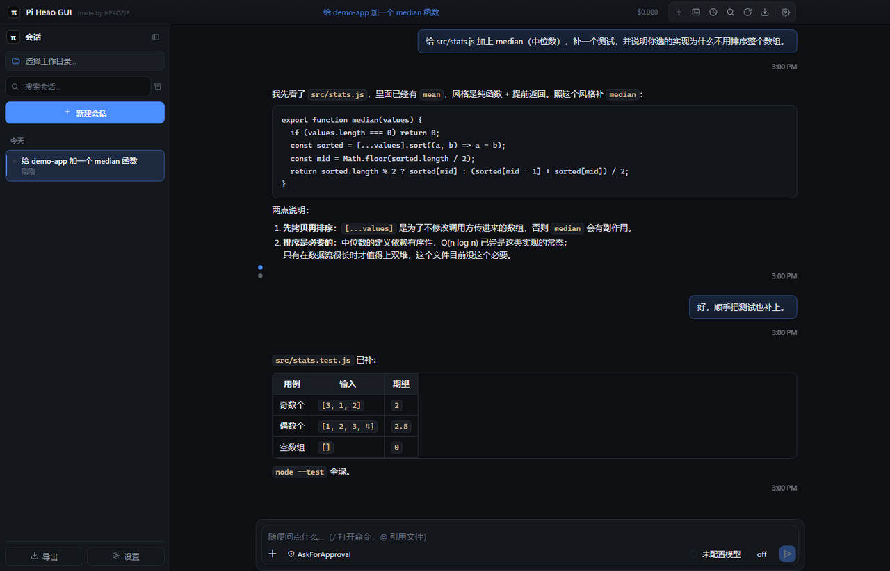
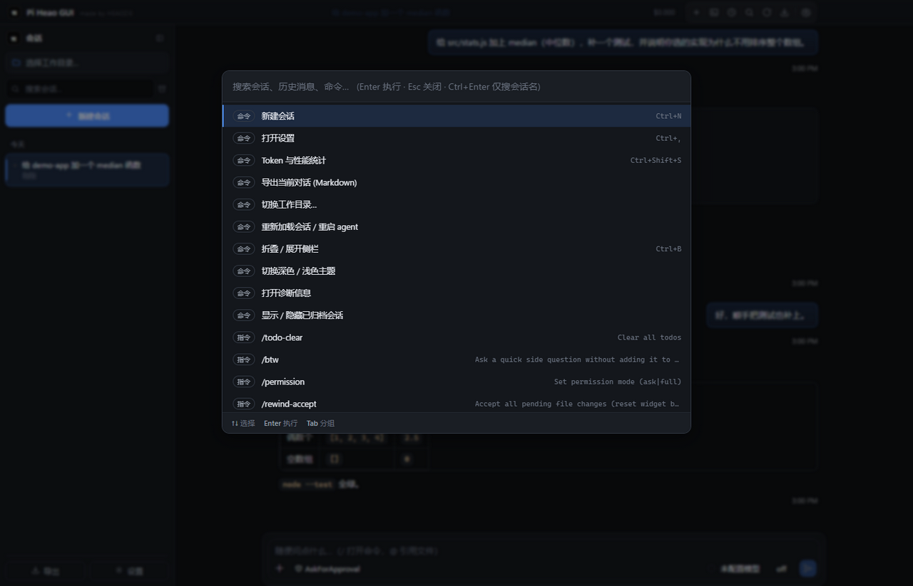
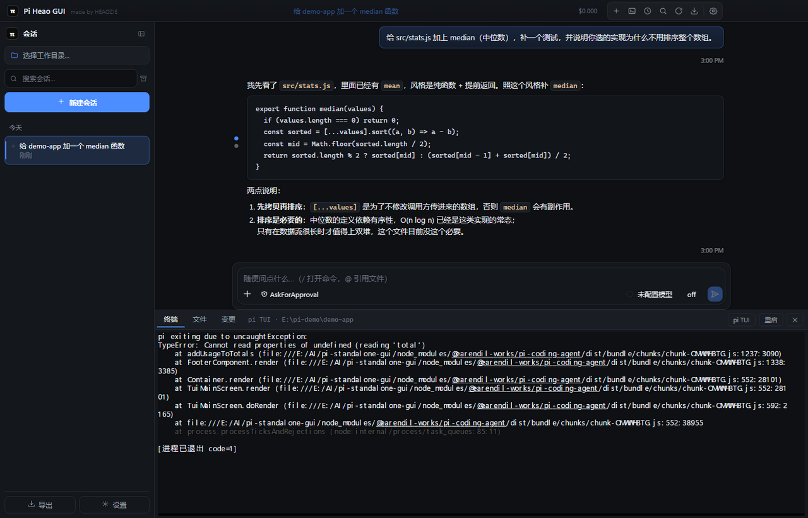
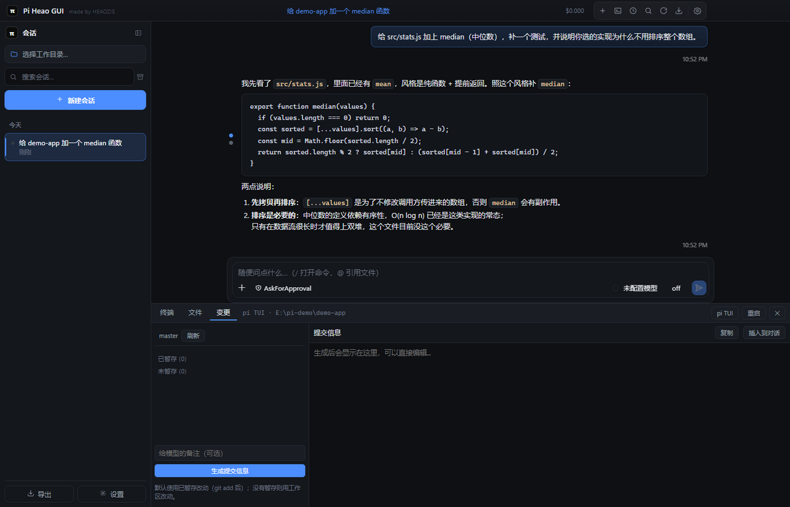
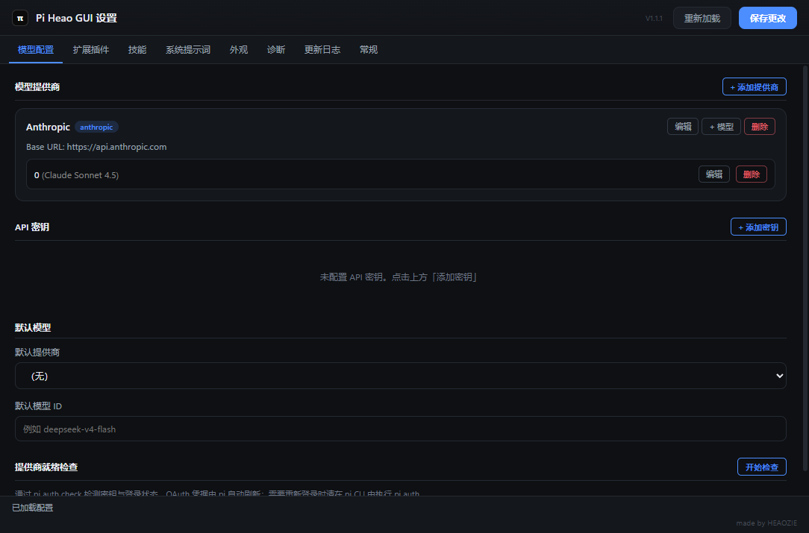
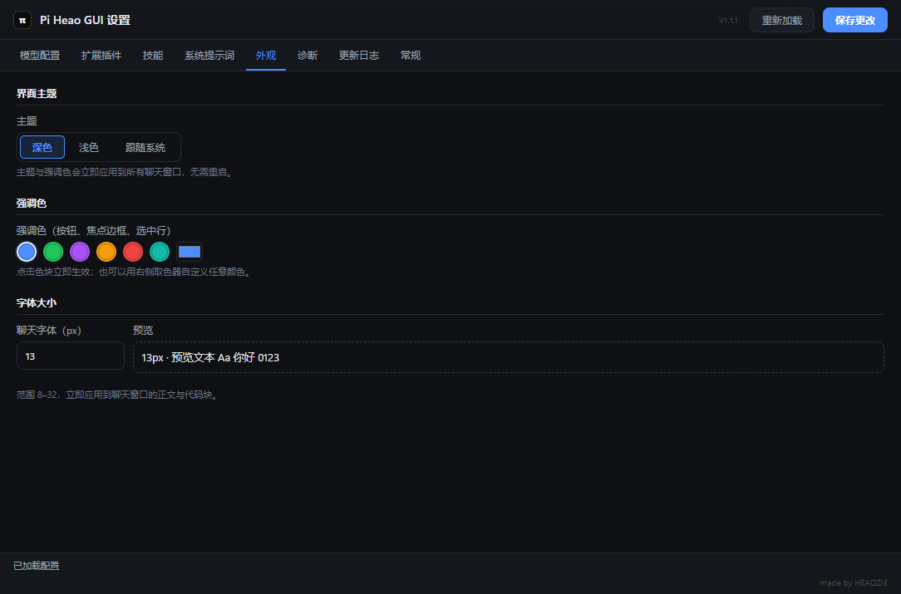

# Pi Heao GUI

> English version: [README.md](README.md) (this file is the Chinese one, and it is canonical).

[](https://github.com/Q1y1ng/pi-heao-gui/actions/workflows/ci.yml)
[](LICENSE)
[](https://github.com/Q1y1ng/pi-heao-gui/releases/latest)


## 1.3.1 更新报告

发布于 2026-09-21 · [完整发布说明](docs/release-notes-1.3.1.md) · [下载 1.3.1](https://github.com/Q1y1ng/pi-heao-gui/releases/tag/v1.3.1)

一次审计（安全 / 稳定性 / 工程流程）之后的修复版：用户能感知的变化集中在两件事上 ——
**「危险命令需确认」真的会拦了**，以及一批会让 pi 进程、回合或窗口卡住的缺陷被修掉。

- **权限门从“空转”变成真拦。** 设置里默认就是 `AskForApproval`，但规则表默认是**空的**，
  而空表在权限门里等于“一条都不匹配” —— 每条 bash 命令都放行；设置界面里又根本没有编辑规则的地方，
  这个默认值无从改起。现在应用**自带 39 条默认规则**（与上游 pi-agent-studio 那套逐字一致，有单测钉住），
  设置 → 权限 里可编辑、一键「恢复默认」，`/permission` 会报出当前模式与生效条数。
- **门不再只管 bash，也不再只管主会话。** `write` / `edit` 的目标路径解析后落在**会话工作目录之外**时要确认
  （这正是“它只改了仓库”实际是改写 `~/.pi/agent/settings.json` 的那条路）；`subagent` 派生的第二个 pi
  此前**没挂门**，等于把危险命令交给子代理就绕过了全部确认 —— 现在它挂同一个门。
- **文件面板不再等于“整个用户目录可读写”。** 文件面板默认根就是家目录，于是聊天窗口（那个专门渲染模型输出、
  被定义为不能碰 agent 配置的窗口）能读 `~/.pi/agent/auth.json`、改写 `~/.pi/standalone/config.json`。
  现在一律拒绝 `~/.pi`、`~/.ssh`、`~/.aws`、`~/.gnupg`、`~/.docker`、`~/.config`、`~/.npmrc`、
  `~/.git-credentials`、`~/.gitconfig` 与 `%APPDATA%`；仓库自己的 `.pi/` 不受影响。
- **不会再有改不掉也看不见的 pi 进程。** pi 退出后连发两条消息会各起一个 pi，后者覆盖引用而前者**永不退出**
  （连应用退出都扫不到它），两个进程还往同一个会话文件里写；子代理此前只有一个出口（调用方 abort），
  子 pi 一卡住整个回合就永远不结束 —— 现在重载互斥，子代理有 15 分钟看门狗（`PI_SUBAGENT_TIMEOUT_MS` 可改），
  超时/中止都杀**整棵**进程树（超时的 `pi install` 同样不再把 npm 子进程留在后台）。
- **打开一个仓库不再等于自动执行它的 `.pi/mcp.json`。** 那个文件本质是一串命令，会话开在该目录就会以你的权限
  启动它们；pi 自己的项目信任门覆盖 settings/extensions/skills/prompts/themes，**偏偏不含 mcp.json**。
  现在会先问一次（列出 server 名字与目录），按目录 + 文件哈希记住，文件被改过会重问；MCP 调用还补上了超时。
- **本版还修了**：改动很大时“生成提交信息”必然因 Windows 命令行长度上限失败；diff 窗口与导入会话可以整读
  任意大小的文件（那个“上限”是在写盘之后才判的）；等终端排队时关窗口留下孤儿终端进程；便携版被推着下载
  “安装包版”的自动更新；诊断包里可能夹带明文密钥；`studio/pi-chat/package-lock.json` 没入库导致同一 tag
  两次构建可以不一致。
- **CI 里现在真的会加载一次终端栈**：新增阻塞步骤 `npm run check:pty`（Electron 下起一个 ConPTY 并要求回显）。
  此前 CI 没有任何一步 `require("node-pty")` —— 原生模块坏掉可以一路绿灯发出去，表现为“终端面板一片空白”。

## 1.3.0 更新报告

发布于 2026-09-19 · [完整发布说明](docs/release-notes-1.3.0.md) · [下载 1.3.0](https://github.com/Q1y1ng/pi-heao-gui/releases/tag/v1.3.0)

- **窗口总览：一眼看清每个窗口在干什么。** 多开几个窗口之后，"谁在跑、谁在等你、谁闲着"此前只能从托盘菜单和
  标题栏拼出来。现在标题栏多一个格子图标：一份**只读**清单（等待回答 → 运行中 → 空闲，同组内最近活动的在前），
  每行写明窗口 / 会话名、状态、未读条数与多久之前，点一行就把那个窗口提到前台。它**不新增任何轮询** ——
  用的都是主进程本来就观察到的状态（流式开始/结束、待处理请求、未读计数），变化时才推。
- **多项目：把常用的目录存下来，一键切换。** 工作目录那一条点开就是项目列表（名字 + 路径，当前项目打勾），
  可以改名、可以从列表移出（**不会动目录**）、目录不在了就标灰；侧栏多了 **「项目 / 时间」** 分组开关，
  按项目分组时会话按它**运行时的目录**归位 —— 所以开在子目录里的会话也归到它所属的项目，嵌套项目优先。
  项目的定义是**一个目录 + 一个名字**，不是新容器：窗口仍然只有一个工作目录，会话、终端、git 面板、文件树照旧跟随。
- **「待你处理」：所有窗口正在等你回答的事，集中在一处。** pi 要一个回答（权限 / 确认 / 输入）时应用本来就会响
  提示音，但**响的是哪件事、在哪个窗口**此前无处可看。现在标题栏的铃铛带计数，点开是一份跨窗口清单，点一条就
  跳到提出它的窗口（回答仍在那里做）；窗口关闭、切换会话、pi 退出都会把条目撤下来。
- **正在跑的时候点「新建会话」，现在给你一个新窗口，而不是一句拒绝。** "这件事先跑着，我另开一件"正是多窗口
  存在的理由 —— 忙碌的窗口把新会话开在**它自己的窗口**里，原回合继续跑。顺带把入口收敛成一个共用函数：
  **文件 → 新建会话（Ctrl+N）与托盘 → 新建会话此前是死的**，点了没有任何反应。
- **一键「新副本」：建一个 worktree，并在新窗口里开始一个会话。** 变更面板里选分支、点「＋ 新副本」，就会在仓库
  旁边建出 `仓库名-分支名` 的工作副本并开一个自己的窗口在其中启动 pi。这是"同一仓库并行推进两件事"缺的最后一块。
- **导入会话：导出有了另一半。** 侧栏「导入」选一个别的机器 / 别的 profile 导出的 `.jsonl`，它就进会话列表、
  点开就是那段对话；跨机器时只把会话头里的工作目录改指向当前目录，**对话本身逐字节不动**，同名不覆盖而是加序号。
- **修复**：点开对话里的链接不再把应用本身导航走（那条路会让远端源拿到 `window.pi`，而白名单里有 `pi:term-input`
  与 `pi:fs-write`）；agent 挂掉时横幅会带上 pi 最后的 stderr（`code 1` 在 Windows 上恰好也是被强制结束的样子）；
  **两个 pi 不再同时往同一个 agent 包里装包**（"反复退出 code 1"的真因）；pi 启动阶段挂掉会自动重开一次；
  切工作副本不再等 pi 启动完；无障碍门禁不再跨主题判色；门禁不再把"窗口没在画"当成应用缺陷。

## 1.2.4 更新报告

发布于 2026-09-19 · [完整发布说明](docs/release-notes-1.2.4.md) · [下载 1.2.4](https://github.com/Q1y1ng/pi-heao-gui/releases/tag/v1.2.4)

- **文件面板会预览图片与音频。** 点开 PNG / JPG / GIF / WebP / BMP / ICO / AVIF / SVG 直接显示图片（按比例缩放
  适配、不拉伸），点开 MP3 / WAV / OGG / M4A / AAC / FLAC / OPUS 显示带控件的播放器。上限 10 MB，走 `data:` URL ——
  页面的 CSP 本来就对 `img-src` / `media-src` 放行 `data:`，所以**没有放宽任何安全策略**。其余文件仍进编辑器：
  判定只看扩展名，`logo.png.bak` 这种备份仍是文本。
- **`Ctrl+S` 再也不会把二进制文件覆盖成空文本。** 快捷键是全局的，它并不知道面板在显示什么；e2e 会校验
  PNG 的字节在按下 `Ctrl+S` 之后**逐字节不变**。
- **编辑器与文件树跟着主题走。** CodeMirror 自带配色是给白底设计的，两套主题上都不可读（门禁量到：浅色下
  行号 **2.85:1**、暗色下字符串 **2.59:1**）；文件树的箭头列叠了 0.7 透明度，把 5.59:1 合成为 **2.99:1**；错误
  横幅的红字压在自己的 14% 红底上只有 **4.0:1**。现在两套主题都过 4.5:1。
- **变更面板的「刷新」会一并刷新工作副本下拉**：应用运行期间用 `git worktree add` 新建的工作副本，不必整页
  重载就能出现在下拉里。

## 1.2.3 更新报告

发布于 2026-09-18 · [完整发布说明](docs/release-notes-1.2.3.md) · [下载 1.2.3](https://github.com/Q1y1ng/pi-heao-gui/releases/tag/v1.2.3)

- **字号设置现在真的会改变聊天文字，而且是实时的。** 这条从 1.2.0 起就挂在“已知缺陷”里，而当时写的解释是错的：
  并不是有哪张样式表压过了我们。最后一层是内置聊天 UI 启动时写在 `<html>` 上的**内联 `--chat-fs`**（取自
  `window.__PI_FONTSIZE__`）—— **内联样式赢过所有样式表**，所以“赢下层叠的那一份”就是加载时写下、此后再不
  改写的那份。现在由应用侧的 shim 把它重新指向主控 token。实测：设为 16 时真消息节点 16px、22 时 22px，
  **运行中改当场跟随**；e2e 已断言这一条。
- **拖出来的会话窗口重新显示对话了。** `preload` 的 `onMessage` 是**单监听器**：外壳自己的标题脚本在**同一
  通道**上又注册了一次，把负责转发宿主消息的 shim 顶掉 —— 窗口标题正确、内容全空，而且**哪里都不报错**。
  本版起精简子窗口恢复为默认，`PI_MINIMAL_CHILD=0` 可切回完整外壳对照。
- **变更面板可以直接切换 git 工作副本（worktree）**：下拉列出所有工作副本（含分离 HEAD 的），选中即切换工作区，
  终端与新会话一起跟随。
- **`PI_DEBUG_WINDOW=1`** 会打印子窗口的 console、preload 错误、加载失败、DOM 指纹与时间序列 —— 默认关闭，
  留给下一次“要看不要猜”的排查。

## 1.2.1 更新报告

发布于 2026-09-15 · [完整发布说明](docs/release-notes-1.2.1.md) · [下载 1.2.1](https://github.com/Q1y1ng/pi-heao-gui/releases/tag/v1.2.1)

- **把会话从侧栏拖出来**，它就在自己的窗口里打开、落在鼠标位置（按所在显示器夹紧）。Electron 没有
  原生 API 做这个手势，所以这套拖拽是本项目自己实现的。
- **拖出来的窗口是精简外壳**：标题栏写着会话名，下面是对话。没有侧栏、没有停靠面板、没有命令面板
  —— 一个窗口，一个会话。主窗口仍然是控制台。
- **它需要你时会出声**：任务结束上行三音，agent 在等你做决定（确权 / 提权 / 确认）时下行两音 ——
  在隐藏渲染层现场合成，所以既没有音频素材，也不依赖那个会被 Windows 专注助手一起静音的系统提示音。
  需要决定的那一刻**即使窗口在前台也会响**，因为回合正卡在那里等人。
- **重启恢复上次的窗口**、托盘里的窗口列表、Ctrl+Shift+N 开新窗口。子窗口上限 6 个，
  超限时直接说明原因，而不是拖了个没反应。

### 这轮实测验出来的

- **依赖漏洞 0**；Electron 43.7.0（该线最新）；本项目自身代码在完整安全 / 工程扫描里 **0 阻断问题**。
- **空闲 CPU 0%**；45 秒内内存漂移 **+3.9 MB**（无泄漏）；单窗口空闲合计 **631 MB**，其中 pi 进程
  占 **247 MB** —— 所以对“精简外壳”的诚实总结是：界面更干净，但并没有轻多少。
- 会话列表轮询改成自适应退避（前台 15 秒 → 后台 30 秒 → 隐藏时完全停），临时文件清扫移到首屏之后。

## 1.2.0 更新报告

发布于 2026-09-14 · [完整发布说明](docs/release-notes-1.2.0.md) · [下载 1.2.0](https://github.com/Q1y1ng/pi-heao-gui/releases/tag/v1.2.0)

这一版**只做界面的正确性**：浅色主题下读不清的字、写死的深色，以及只在启动时生效一次的外观设置。

- **浅色主题读不清的问题修好了。** 消息标题与粗体曾是写死的 `#f2f4f8` —— 白底上只有 **1.1:1**；
  代码块是写死的近黑；链接用的是原始强调色（**3.20:1**）。现在全部跟随主题，链接实测 **6.54:1**。
- **测试里加了一条对比度门禁。** `npm run e2e` 会在浅色与深色下遍历每个元素，低于 4.5:1 即失败
  （大字与 UI 组件按 WCAG 1.4.11 取 3:1）。做这条门禁的过程中它自己抓出四个真缺陷 ——
  `.pi-tb-brand` 2.2:1、`empty-hint` 4.31:1、`pi-dock-meta` 3.50:1、`pi-git-del` 4.20:1 ——
  全部修完并复验为 **0 失败**。
- **外观改动现在实时生效。** 启动之后改主题、强调色或字号，过去会落在一个忽略它们的文档上；
  强调色则只有第一次改动有效。两者都已修好。
- **回答默认展开**，按钮为「收起」；正文不再是点击区，选中文字不会再折叠整段。
- **已知问题（1.2.3 已修）**：字号设置当时不会改变聊天文字大小。证据与下一步该做的测量见
  [docs/KNOWN-ISSUES.md](docs/KNOWN-ISSUES.md)。

安装版会自动更新；便携版需要手动换包。

**把 `pi` 编码 agent 从终端搬进桌面。** 一个独立的 Electron 外壳，把原本要依赖 VS Code 宿主提供的
侧栏 / 终端 / 编辑器桥 / diff / 密钥存储 / 设置界面全部自己做掉，并补上遥测、命令面板、
自动更新与中英界面。

`studio/` 里的聊天界面**是本项目自己的代码** —— 和其它部分一样可以随意改。它的来源与所携带的
MIT 声明记录在 [NOTICE.md](NOTICE.md)。

同类工具各有各的路线：`pivot-ui` 是浏览器工作区、`pi-gui` 另起了一套 Codex 风格的桌面 UI、
`pi-harness` 面向无头运行与运行时监控；**本项目的取舍只有一个 —— 把那份 UI 搬进 Windows 桌面、由我们自己维护**，其余一切都围绕这一点展开。详见下文「与同类项目的区别」。

**[下载最新版](https://github.com/Q1y1ng/pi-heao-gui/releases/latest)** ·
[保真度审计](docs/FIDELITY.md)（上游聊天层保留 143/253 个符号） ·
[文档索引](docs/README.md) · [变更记录](CHANGELOG.md)



> 截图全部由 `npm run shots` 在**隔离沙箱**里生成：合成会话 + 临时工程，
> 因此不会带出任何真实会话名、路径或配置。


## 功能

### 对话

- 流式聊天（复用上游 `pi-chat` UI）、模型与 thinking level 切换、fork / revert
- **回答默认展开**，按钮是「收起」；正文不再是点击区，选字不会再误折叠整段
- `@file` 文件补全、文件对话框、Mermaid 与 KaTeX 渲染
- 输入框里**粘贴整段内容可用 `Ctrl+Z` 一步撤回**：粘贴走的是浏览器的原生编辑，因此它和
  逐字输入一样进撤销栈（上游原本是拦下粘贴后重建 DOM，所以怎么撤都撤不掉）
- 内置 diff 窗口，读 rewind 扩展的快照作基线
- 命令面板（`Ctrl+K`）：命令、会话、斜杠指令、历史命中



### 会话

- 侧栏：新建 / 切换 / 重命名 / 置顶 / 搜索 / 归档 / 恢复 / 删除、右键菜单、键盘导航、拖拽文件
- 归档走 `sessions/_archived/`，pi CLI 也不再列出；删除当前正在使用的会话会被拒绝并说明原因
- 跨会话全文搜索，命中后可直接跳到那条消息并高亮
- 导出对话为 Markdown，也能**导入**别处（别的机器 / 别的 profile）的 `.jsonl` 会话：进列表、点开就是那段对话
- 多窗口：每窗口独立 pi 进程与独立工作目录
- **待你处理**：pi 等一个回答（权限 / 确认 / 输入）时，标题栏会亮出计数，面板里列出**所有窗口**正在等的事，
  点一条就跳到提出它的那个窗口（回答在那里做）。跨窗口生效：子窗口里的提问，主窗口也会亮
- **窗口总览**：一眼看清每个窗口在干什么（等待回答 / 运行中 / 空闲 + 未读），点一行切过去
- **多项目**：把常用的目录存成项目（可改名），工作目录那一条点开就是项目列表 —— 一键切换，
  侧栏可以按项目分组，会话按它运行时的目录自动归到对应项目（子目录里的会话也归它）

### 终端 / 文件 / 变更（底部 Dock）

对应原插件的终端、编辑器桥与提交流程：

- **终端**：真 PTY（node-pty + ConPTY）＋ xterm.js，默认直接在 PTY 里跑 `pi` TUI，可一键切到系统 shell
- **文件**：工作区文件树 + CodeMirror 编辑器，保存、把选中内容一键发送到对话输入框
- **变更**：git 分支与暂存状态、逐文件 diff、"生成提交信息"（沿用上游提示词与截断策略）；
  多工作副本可下拉切换，也可**一键建新副本**（在旁边建出 `仓库名-分支名`，并开一个新窗口在其中开始会话 —— 原窗口继续跑）





### 遥测

- Token 与性能面板（`Ctrl+Shift+S`，或点标题栏指标）：首 token 延迟、解码速度、
  t/s、缓存命中率、推理占比、TTFT 的 p50/p95、逐轮表格、每日与每月花费、预算提醒
- 统计按会话持久化，重开会话即恢复；标题栏常驻显示上下文占用 / TTFT / 速度 / 本次花费

### 设置与外观

- 八个标签页：模型配置、扩展插件、技能、系统提示词、外观、诊断、更新日志、常规
- 主题（深/浅/跟随系统）+ 任意强调色 + 字号；`uiLanguage` 支持中/英/跟随系统
- **浅色与深色都过了一遍自动化对比度检查**（`npm run e2e` 遍历页面上每个元素，低于 4.5:1 即失败；
  大字与 UI 组件按 WCAG 1.4.11 取 3:1）—— 它第一次运行就抓到了两个真缺陷
- 扩展包管理（`pi install / remove / list`）、技能增删改、provider 就绪检查、pi 更新日志、诊断包





### 平台集成

- 系统托盘：最近会话、未读计数、显示主窗口、退出；桌面通知；关闭到托盘
- **自动更新**：启动 20 秒后检查本仓库 Release，发现新版自动下载，可在
  设置 → 诊断 → 版本与更新 手动检查并一键重启安装（源码运行时不检查；
  `autoCheckUpdates: false` 可关闭）。**便携版不支持自更新**，需手动换包
- bundled 扩展：todo、subagent、questionnaire、permission-gate、rewind-code、btw、mcp

## 与同类项目的区别

同类项目不止一个，形态各不相同。下表按各家仓库与包的自述归纳（细节以它们自己的文档为准）：

| 项目 | 形态 | 它解决的是什么 |
| --- | --- | --- |
| **本项目** | Windows 桌面应用，聊天层取自 studio 的 UI 代码（现已归本项目维护） | 不从零设计界面：起点就是那份 UI，之后由我们按需修改 |
| [pivot-ui](https://github.com/sincw/pivot-ui) | 浏览器工作区（本机起服务） | 一台机器跑、多设备访问（含手机）；界面自成一套 |
| [pi-gui](https://www.pi-gui.com/) | 另一套桌面 UI（Electron，Codex 风格） | 会话时间线、每线程 git worktree、多 agent 编排；发布面向 macOS / Linux |
| `pi-harness` 类（[npm](https://www.npmjs.com/package/pi-harness) / [runtime 包](https://pi.dev/packages/pi-harness-runtime)） | 无头服务与运行时监控 | 把 pi 跑成后台服务、做用量统计与任务编排；本身不是给人看会话的界面 |

一句话：**要「和我熟悉的界面一模一样，只是不再需要 VS Code」，选这个；要另一种形态的工作区
（浏览器 / 服务端 / 多 agent 工位），那几类更对口。**

### 谁适合用

- 你在终端里用 pi，想要一个 **Windows 桌面窗口**，但不想重新适应一套新界面。
- 你在意与 VS Code 插件**行为一致**：`@file`、Mermaid / KaTeX、diff 窗口、权限门、`/login` 流程都在。
- 你需要 Windows 安装包 / 便携版、托盘、桌面通知、自动更新、中英界面。
- 你想让聊天、真终端、文件编辑、git 提交在**同一个窗口**里完成。

### 谁不适合用

- 你想在**手机或平板**上使用 —— 浏览器路线（[pivot-ui](https://github.com/sincw/pivot-ui)）更合适。
- 你要的是**无头 / 常驻服务**，或把 pi 当作别的前端的后端。
- 你主要在 **macOS / Linux** 上工作 —— 本项目只发布 Windows 包（外壳是 Electron，
  但没有为其他平台做过适配与测试）。
- 你需要 **LSP / 诊断 / 符号跳转** —— 那来自 VS Code 的语言服务，剥离后不再具备。
- 你**不想安装 Node 与 pi CLI** —— 本应用是外壳，不自带 agent 运行时。

## 快速开始

1. **装 `pi`**（应用自身要依赖它）：

   ```bash
   npm install -g --ignore-scripts @earendil-works/pi-coding-agent
   ```

2. **装本应用**：到 [最新版 Release](https://github.com/Q1y1ng/pi-heao-gui/releases/latest) 下载
   `Pi-Heao-GUI-Setup-<版本>.exe` 双击安装（可自选目录，自动建桌面与开始菜单快捷方式，带卸载项）；
   或下载 `Pi-Heao-GUI-<版本>-Portable.exe` 免安装直接运行。

   > **包目前未签名**，首次运行 Windows SmartScreen 会提示"已保护你的电脑"：点
   > "更多信息 → 仍要运行"，或先比对 Release 页面上的 SHA256。
   >
   > Windows builds are published unsigned for now. Signing is being applied for through the
   > **[SignPath Foundation](https://signpath.org/foundation)**, which provides free code
   > signing for open-source projects; the repository side is ready
   > (`signpath/artifact-configuration.xml` plus a manually triggered
   > `.github/workflows/sign-windows.yml`). Verify the SHA256 on the release page in the
   > meantime. 签名后的包会**同名替换** Release 附件并同步更新校验和。

3. **配 provider**：在应用内「设置 → 模型配置」查看就绪状态，需要登录时点一键登录 —— 它会在
   内置终端里运行 pi 自己的 `/login <provider>`，凭据由 pi 写入 `~/.pi/agent/auth.json`。

## 前置要求

- **Windows 10 / 11**（x64）
- **Node.js ≥ 22** —— 仅用于安装 `pi` CLI
- **pi CLI**：`npm install -g --ignore-scripts @earendil-works/pi-coding-agent`
- **至少一个 provider 的凭据**（写在 `~/.pi/agent/auth.json`，或让应用带你在终端里登录）

首次启动时应用会检查 `pi` 是否存在；找不到会弹出安装指引并可直接跳到设置里指定路径。

## 依赖与上游

这个项目是**外壳**，不是引擎 —— 模型调用、工具执行、会话管理都在 `pi` CLI 里，这里一行都没有。
它依赖两样东西，而这两样的**性质完全不同**：

| 依赖 | 性质 | 怎么绑定 | 上游变了怎么办 |
| --- | --- | --- | --- |
| **`pi` CLI** | 运行时**必需**，以 `--mode rpc` 在外驱动 | 走 pi 的公开 RPC 协议，**不 patch pi** | 协议变了就得跟 —— 这是**较硬**的一条依赖 |
| **pi-agent-studio 的聊天 UI 与 bridge 扩展** | **代码副本，已归本项目维护**（不是“参考设计”，也不再要求与上游一致） | 分叉自 tag `v1.3.8`（commit `8c50c0a`）；之后可任意修改 | 上游发新版**不影响我们**；想要它的新东西时按 [docs/UPSTREAM.md](docs/UPSTREAM.md) 主动吸收 |

**第二行值得说清** ✓：`studio/` 里放的就是那份 MIT 代码（`pi-chat/` 聊天 UI、
`bridge/` 扩展、`pi-mcp/`、`assets/`），[docs/FIDELITY.md](docs/FIDELITY.md) 逐符号记录了当初的保留率
（**143/253 = 57%**，未保留的绝大多数是 VS Code 宿主专有函数）—— 也就是说，**看聊天界面时，
你看的就是那份原版 UI** ✓。

区别在于**谁来决定它的下一版**：以前我们钉住上游、用 CI 强制字节一致 ✗，上游发版就可能让我们变红；
现在这份代码是我们的 ✓，改哪里由我们决定 ✓，上游只是“想要它的新东西时可以去取”的源 ✓（先 diff、
按需取，可只取一部分 ✓）。

同样诚实地说：**体验上限由 pi 决定**。这个壳不会去修 pi 的行为，也不会加 pi 做不到的能力；
若你要的是“重新设计一套 agent 界面”，那属于另一类工具 —— 见上文「与同类项目的区别」。

## 从源码构建

```bash
git clone https://github.com/Q1y1ng/pi-heao-gui.git
cd pi-heao-gui
npm ci
npm run build:renderer   # 构建我们那份 pi-chat UI（5.7 MB 产物不入库，首次需联网）
npm run build            # 编译 TypeScript + 内联 xterm/CodeMirror
npm start                # 开发模式运行
npm run dist             # 打包：便携版 + NSIS 安装包（输出到 dist-electron/）
```

发布用的源码包（Release 里的 `*-source.zip`）已经包含那份 UI 产物，解压后
`npm ci && npm run build` 即可，无需联网重建。

## 配置

应用配置在 `~/.pi/standalone/config.json`（也可在应用内「设置」里编辑），
`pi` 自身的配置仍在 `~/.pi/agent/`（`settings.json`、`models.json`、`auth.json`、`SYSTEM.md`），
与 VS Code 插件共用同一份。

| 字段 | 说明 |
| --- | --- |
| `piPath` | pi 可执行文件路径，留空自动检测 |
| `workspaceRoot` | 默认工作目录（`@file` 搜索根） |
| `theme` / `accent` / `chatFontSize` | 外观 |
| `uiLanguage` | `auto` / `zh-cn` / `en` |
| `permissionMode` | `AskForApproval` / `FullAccess` |
| `dangerousPatterns` | 需确认的命令规则（正则数组）；**缺这个键 = 用自带的 39 条默认规则**，显式写成 `[]` 才是主动关掉。可在设置 → 权限 里编辑 / 恢复默认 |
| `mcpEnabled` / `mcpIdleTimeout` | MCP 扩展开关与空闲超时 |
| `disabledTools` | 禁用的工具列表 |
| `autoCheckUpdates` | 是否在后台检查更新（默认开） |
| `budgetDailyUsd` / `budgetMonthlyUsd` | 花费预算，超出只提醒、不中断 |
| `favoriteModels` / `recentWorkspaces` | 模型选择器置顶、最近工作目录 |
| `commitLanguage` / `commitMessagePrompt` | 生成提交信息的语言与附加提示 |
| `openAtLogin` / `showArchived` | 开机自启、是否显示已归档会话 |

**数据位置**：会话在 `~/.pi/agent/sessions/`（由 pi 管理），统计与窗口状态在应用数据目录
（Windows 为 `%APPDATA%\pi-heao-gui`）。卸载程序**不会**删除这两处；要彻底清理手动删除即可，
细节见 [PRIVACY.md](PRIVACY.md)。

## 架构

```text
Pi Heao GUI (Electron Main, Node.js)
  ├─ spawn pi --mode rpc  (JSONL stdio)
  ├─ chat-session 编排
  ├─ IPC handlers
  └─ settings / sessions / file ops / updater
Electron Renderer (Chromium)
  ├─ pi-chat UI (our fork, single-file HTML)
  ├─ acquireVsCodeApi shim → window.pi (preload bridge)
  ├─ 会话侧栏 / 标题栏 / 统计面板 / 命令面板 (injected)
  └─ Dock：终端(xterm.js) · 文件(CodeMirror) · 变更(git)
```

终端与文件面板需要主进程侧的原生/IO 能力：`node-pty`（N-API 预构建，Electron 与 Node 共用同一
二进制）、受工作区根目录约束的 `pi:fs-*`、以及 `pi:git-*`（提交信息用 `pi -p` 一次性生成，
不污染会话）。

上游源码（现已归本项目维护）位于 `studio/`（MIT），只保留 `pi-chat/`、`bridge/`、`pi-mcp/`、
`assets/` 等运行时必需品；分叉自上游 tag `v1.3.8` / commit `8c50c0a`，主动吸收上游新变动的流程见
[docs/UPSTREAM.md](docs/UPSTREAM.md)。外壳为何必须重写、以及实现中踩过的坑见
[docs/ARCHITECTURE.md](docs/ARCHITECTURE.md)。

## 开发脚本

```bash
npm run build           # 编译 main/preload → dist/ + 拷贝 renderer + 内联 xterm/CodeMirror
npm start               # 直接启动（需先 build）
npm run dev             # 监听式开发
npm test                # 构建 + node:test 单元测试（跑在编译产物上）
npm run e2e             # 端到端：逐页面逐功能，只读
npm run e2e:isolated    # 端到端：沙箱内跑破坏性流程（改名/归档/删除/写盘/语言切换）
npm run smoke           # 运行时冒烟：开真窗口断言安全边界
npm run verify          # 真机 UI 功能断言（面板 / 命令面板 / 侧栏 / 终端 / 文件 / 变更 / diff）
npm run test:daily      # 日常流程端到端：真窗口 + 真模型，让 agent 建文件、写测试、跑测试（需 provider）
npm run measure-load    # 会话切换耗时归因（pi 解析 vs 渲染）
npm run check:package   # 断言打包产物（asar）含全部运行时依赖（需先 npm run dist）
npm run check:pty       # 终端栈自检：Electron 下起一个 ConPTY 并要求回显（CI 里是阻断步骤）
npm run shot            # 截图（拍本机现状，仅供人工核对，**不入库**）
npm run shots           # 生成 README 配图：隔离沙箱 + 合成会话，输出到 docs/images/
npm run typecheck       # tsc --noEmit
npm run lint            # biome lint（--write 自动修）
npm run dist            # 打包便携版 + NSIS 安装包
npm run dist:portable   # 只打便携版
npm run icon            # 重新生成 build/icon.png + 多尺寸 .ico
npm run build:renderer  # 重建我们那份 pi-chat 单文件 UI（首次需联网装依赖）
npm run build:mcp       # 重建自带的 MCP 扩展 bundle
```

**测试与 CI**

- `npm test` 覆盖配置校验、密钥掩码往返、`shell.openPath` 扩展名黑名单（含尾随点/空格
  归一化）、**工作区路径逃逸（符号链接 / junction）**、**权限门的判定（默认规则表与空表、工作目录
  内外的写入、junction 逃逸、无效正则）**、**超时杀进程树（真 spawn 一个孙进程再验证它没了）**、
  Windows shim 解析（含 `&` 注入回归）、会话列表缓存、生成 HTML 的 CSP 与注入转义、注入脚本能否解析、
  生成页面的**重复 id 审计**、preload 通道覆盖、i18n 完整性、更新状态机（含便携版不自动更新）、
  诊断日志脱敏。
- `npm run e2e` / `npm run e2e:isolated` 打开**每个窗口与面板**并断言点击后的真实变化
  （不是元素存在），**任何渲染进程报错都判定失败**；隔离模式把 HOME/APPDATA 指向临时目录，
  破坏性操作用的是沙箱内的副本。
- `.github/workflows/ci.yml`：`lint + typecheck + test + check:pty` 与 `package`（打包产物含全部运行时依赖）
  为**阻断**作业，`smoke` 为咨询作业；依赖审计为咨询步骤，另有 Dependabot 分组跟进依赖。
  `check:pty` 是唯一会 `require("node-pty")` 的一步 —— 原生模块在 Electron ABI 下装不起来时，
  它能当场变红，而不是等用户看到“终端面板一片空白”。
- `npm run check:package` 是“装得上且装得全”的守卫：读 `app.asar` 头部断言 14 条运行时
  路径（自带聊天 UI、bridge 扩展含权限门的判定模块、node-pty 原生模块等）都在包里。
- `npm run test:daily` 是唯一能证明“**这个应用真能把一件事做完**”的门禁：它开真窗口、
  用真模型（你指定的 provider），让 agent 建文件、写测试、跑测试，并且**以磁盘上的产物**
  作为完成判据（不是看界面文字猜结束）。其余检查只能证明控件在、桥在、数据在流动，
  证明不了这一条 —— 所以发版前必跑。

## 故障排查

| 现象 | 原因与处理 |
| --- | --- |
| `npm start`、`npm run smoke` 或打包好的 exe **无提示秒退**（退出码 0，连 userData 都不创建） | 当前 shell 里有 `ELECTRON_RUN_AS_NODE=1`，Electron 退化成了纯 Node.js。清掉它：PowerShell `$env:ELECTRON_RUN_AS_NODE = ""`，bash `unset ELECTRON_RUN_AS_NODE` |
| 首次运行被 SmartScreen 拦住 | 包未签名（见上）。点"更多信息 → 仍要运行"，或先比对 Release 页面上的 SHA256 |
| 提示找不到 `pi` | 按应用内指引安装，或在 设置 → 常规 里指定 `piPath` |
| 终端面板起不来 | 需要绝对可执行路径；若 `piPath` 指向 shim（`.cmd`）请留空让应用自行解析。面板的 meta 行会显示实际使用的 shell |
| **改了字号，聊天文字大小不变** | **1.2.3 已修**：真凶是内置聊天 UI 启动时写在 `<html>` 上的**内联 `--chat-fs`**（内联赢过所有样式表），应用侧 shim 现在把它重新指向主控；证据见 [docs/KNOWN-ISSUES.md](docs/KNOWN-ISSUES.md) |
| 常用命令也弹确认 | 那就是自带的规则表在工作：在 设置 → 权限 里改规则、点「恢复默认」，或把模式改成「完全访问」。规则表**清空 = 什么都不拦**，界面会这么说 |
| 写工作目录之外的文件弹确认 | 同样是有意的：agent 要离开你打开的那个目录。确认框里写清了它解析后的真实路径与用来比较的工作目录 |
| 便携版说它不能自更新 | 对：便携版与安装版共用 release 通道，所以应用让你从 Releases 下载新的 `Portable.exe`，而不是静静装出第二份副本 |
| 想确认终端原生模块没坏 | `npm run check:pty`（CI 里的阻断步骤，Electron 下起 ConPTY 并要求回显） |
| 会话很多时启动慢 | 会话元数据是异步 + 缓存的；首次仍会较慢（要读一遍 session 文件） |
| 想彻底卸载 | 卸载程序只删程序本体。会话在 `~/.pi/agent/sessions/`，应用数据在 `%APPDATA%\pi-heao-gui`，配置在 `~/.pi/standalone/config.json` |

## 安全模型

聊天窗口渲染的是**不可信的 agent/工具输出**，因此边界按窗口划分：

- **聊天窗口 preload**（`src/preload/preload.ts`）：`window.pi.invoke` 走通道白名单，只能访问
  聊天类通道；读不到也改不了 `~/.pi/agent/auth.json` / `settings.json` / 应用配置。
- **设置窗口 preload**（`src/preload/preload-settings.ts`）：只有它能读写配置与 agent 文件，
  且不能驱动 agent。
- **API Key 掩码**：`auth.json` 永远不以明文回传渲染层；表单里显示的 `••••` 表示"保持不变"，
  写回时由主进程还原真实值。
- **CSP**：聊天页与设置页都带 `default-src 'none'` 起手的 CSP（无远端脚本、无远端请求）。
  **已知取舍**：脚本是内联注入的，策略里带 `script-src 'unsafe-inline'`，因此 CSP 只防外联、
  不单独承担防 XSS —— 注入点靠拼接处逐一转义（`sidebar` / `dock` / `palette` / `settings` 各自
  有 `esc()`），而不是靠策略兜底。改用 nonce/hash 需要给每个注入脚本在运行时算哈希，
  尚未做。
- **工作区约束**：文件面板只接受相对路径，且**解析真实路径后**（跟随 symlink/junction）
  必须仍在工作区内 —— 否则返回“路径无效”。无法验证时**拒绝**而不是放行。
  代价是：工作区里指向外部的软链不会在文件树里显示。
- **受保护位置**：无论工作区指向哪里，`pi:fs-tree/read/media/write` 都拒绝 `~/.pi`（会话、快照、
  settings/auth、应用配置、pi 装的扩展包）、`~/.ssh`、`~/.aws`、`~/.gnupg`、`~/.docker`、`~/.config`、
  `~/.npmrc`、`~/.git-credentials`、`~/.gitconfig`（git 的 `core.sshCommand` 就是一个命令执行入口）
  与 `%APPDATA%`（`userData/bridge-extracted/*.ts` 是每个 pi 都拿 `-e` 执行的）。
  判断用的是 `isWithin()`：**文本命中或真实路径命中任一即算命中** —— 工作区里指向 `~/.pi` 的 junction
  必须被拦下。仓库自己的 `.pi/` 不在名单里（那是你的仓库，不是 agent 状态）；
  想在 `~/.pi` 里改东西，走**设置窗口**或 pi CLI，那条路没有被封。
- **权限门**：`AskForApproval`（默认）下，命令命中规则表、或 `write`/`edit` 写到工作目录之外时弹确认；
  规则表自带 39 条默认值（设置 → 权限 可改/恢复/清空）。子代理（`subagent` 工具启的第二个 pi）挂同一道门，
  所以把危险命令“外包”给子代理不能绕过确认。**它是一道提问防线，不是沙箱**：形状写法的绕过（`r\m -rf`、
  base64 管道）它拦不住 —— 它拦的是“你确定的那些形状”，而不是“所有可能”。
- **项目级 MCP**：打开一个目录时，它自己的 `.pi/mcp.json` 里的 server 会先询问（列出名字与目录），
  选“信任并记住”后按**目录 + 文件哈希**记住；文件被改会重问。pi 自己的项目信任门不覆盖 `mcp.json`，
  所以这道确认由应用补上。
- **`shell.openPath` 黑名单**：先做路径归一化（去掉 Windows 会静默吃掉的尾随点/空格，
  否则 `evil.exe.` 能绕过 `extname` 检查），再拒绝
  `.exe/.bat/.cmd/.ps1/.vbs/.lnk/.js/…` 等可执行类型与 UNC/设备路径。
- **子进程**：Windows 下的 `pi.cmd` 会被解析成 `node cli.js` 直接 spawn，参数不经过 `cmd.exe`
  （否则 `&` 就是命令注入）。
- **单实例锁**：避免两个实例并发写配置或抢同一会话文件。
- 三个窗口均为 `contextIsolation: true`、`nodeIntegration: false`、`sandbox: true`。

漏洞与隐私细节见 [SECURITY.md](SECURITY.md) 与 [PRIVACY.md](PRIVACY.md)。

## 与 VS Code 插件的差异

| 能力 | VS Code 插件 | 本应用 |
| --- | --- | --- |
| 聊天 UI | ✓ | ✓ **同一份 UI 代码**（现已归本项目维护） |
| 终端 TUI | ✓（VS Code 集成终端） | ✓（node-pty + xterm.js，同样跑 `pi` TUI） |
| 编辑器桥（选区/文件→对话） | ✓ | ✓（Dock 文件面板 + 发送选中） |
| SCM 提交信息 | ✓ | ✓（Dock 变更面板） |
| 会话侧栏 | ✓ | ✓（分组 / 归档 / 键盘导航为额外增强） |
| 设置面板 | ✓ | ✓ |
| 更新日志查看 | ✓ | ✓（设置窗"更新日志"标签页） |
| OAuth 登录流程 | ✓（`models/oauth-flow.ts`） | ✓（在内置终端里跑 pi 自己的 `/login`） |
| 诊断 / LSP / 符号 | ✓ | ✗（依赖 VS Code 语言服务，不可剥离） |
| 每会话独立工作目录 | ✓ | ✗（pi 没有 `set_cwd`，改为每窗口一个） |
| 资源占用 | VS Code 全家桶（同机实测 15 进程 / 2.3 GB） | 4 进程外壳（约 0.5 GB）+ pi 子进程（约 0.3 GB） |

完整审计（符号级保留率、为什么外壳必须重写、未移植清单）见 [docs/FIDELITY.md](docs/FIDELITY.md)。

## 文档

全量索引在 **[docs/README.md](docs/README.md)**，常看的几份：

| 文档 | 内容 |
| --- | --- |
| [docs/ARCHITECTURE.md](docs/ARCHITECTURE.md) | 形态与关键决策、踩过的坑 |
| [docs/UPSTREAM.md](docs/UPSTREAM.md) | 我们那份 UI 的来龙去脉，以及主动吸收上游的流程 |
| [docs/FIDELITY.md](docs/FIDELITY.md) | 与原插件的保真度审计 |
| [docs/RELEASING.md](docs/RELEASING.md) | 发布、校验和、源码包、代码签名、更新清单 |
| [docs/KNOWN-ISSUES.md](docs/KNOWN-ISSUES.md) | 未结项缺陷的实测证据与下一步 |
| [CHANGELOG.md](CHANGELOG.md) | 全部版本的变更记录 |
| [CONTRIBUTING.md](CONTRIBUTING.md) | 开发流程与五条硬规则 |

## License

MIT —— 见 [LICENSE](LICENSE)。

上游 [pi-agent-studio](https://github.com/JohnnyZ93/pi-agent-studio) 同为 MIT；
分叉自上游的部分的来源与许可见 [NOTICE.md](NOTICE.md)。
